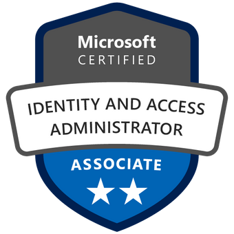
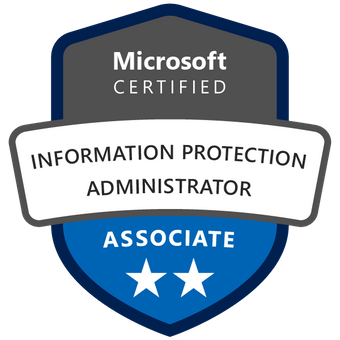
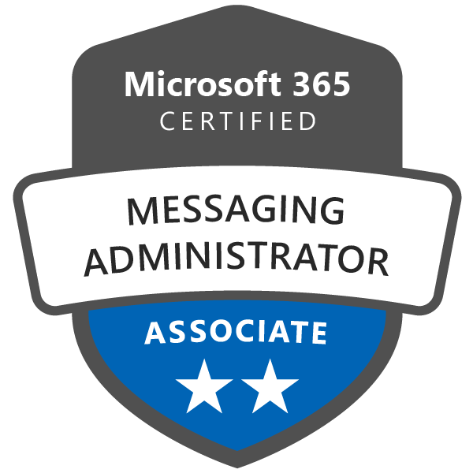
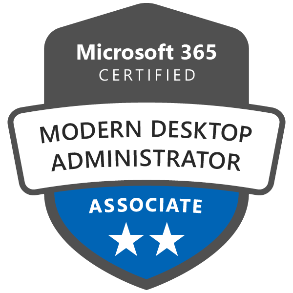
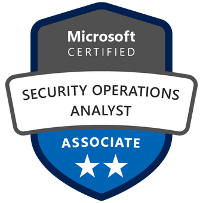
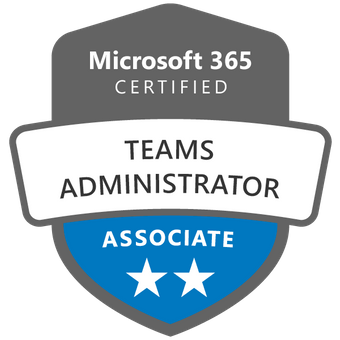
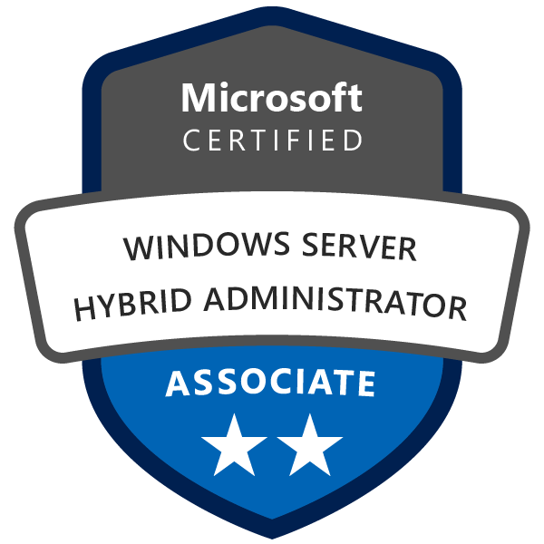
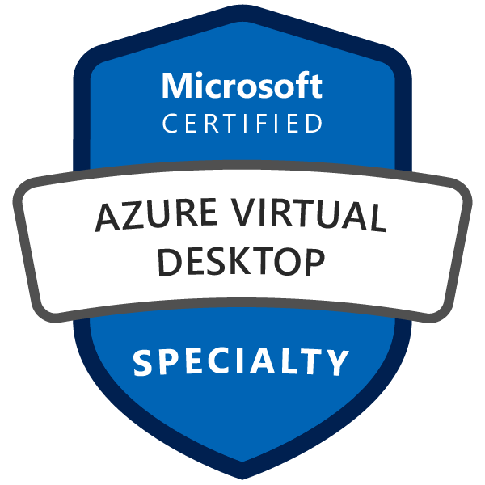

With a foundation built upon extensive expertise as a TOGAF Certified Solutions Architect and Microsoft Certified Trainer and Expert, my professional journey has been deeply entrenched within the intricate landscape of the Public Sector. My experience spans across diverse domains including Local Government, Education, and Healthcare, offering a seasoned perspective honed through hands-on involvement.

Currently serving as a Senior Cloud Consultant at a distinguished Microsoft Partner, my primary focus revolves around delivering exceptional services within the realms of Microsoft 365 and Azure. My commitment lies in orchestrating and implementing sophisticated solutions, guiding them seamlessly from the initial Proof of Concept (PoC) phase through to their ultimate deployment.

Throughout my career, I have specialised in crafting tailored solutions that cater to the unique needs of a varied clientele hailing from different industries. My passion lies in leveraging my expertise to not only meet but exceed expectations, ensuring that the solutions I architect bring tangible value and innovation to the table.

I am dedicated to staying at the forefront of technology trends and advancements within the Microsoft ecosystem, allowing me to consistently provide cutting-edge and forward-thinking strategies to address complex challenges. My goal is to continue contributing my wealth of knowledge and hands-on experience to drive successful outcomes for businesses while remaining committed to the continuous pursuit of excellence within the realm of Microsoft solutions.

<h2>My Microsoft Certifications</h2>
<h2>Microsoft Trainer Certification</h3>

  


<h2>Expert Level Certifications</h2>

  
  


<h2>Associate Level Certifications</h2>

  
  
  
  
  
  
  
  
  
  


<h2>Fundamental Level Certifications</h2>

  
  
  
  
  
  
  
  


<h2>Speciality Level Certifications</h2>

  
