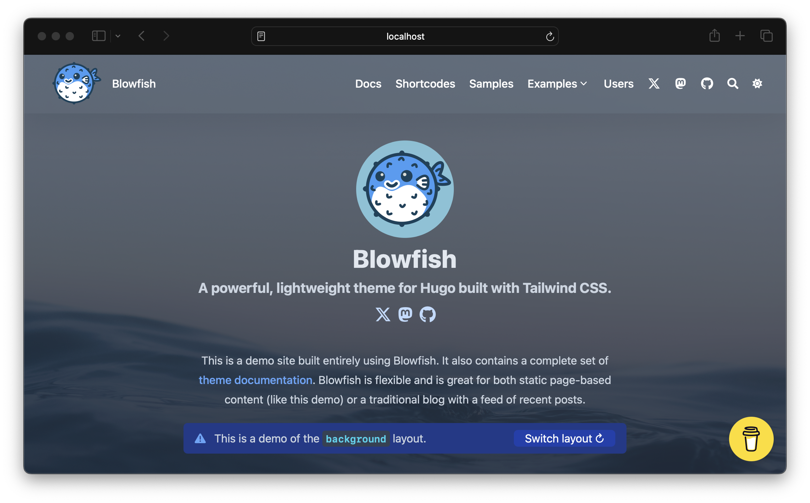
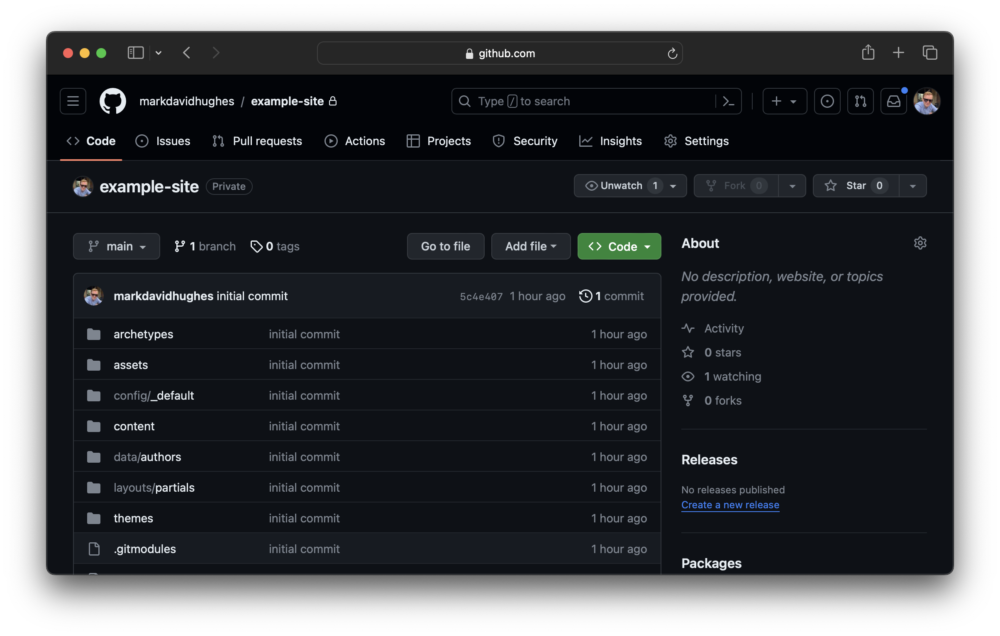


Discover how to create your very own blog just like this one.


This site was built using Hugo and is hosted using a static web application in Microsoft Azure. There are associated GitHub actions which control how the site is built and published.

It uses the Blowfish theme created by Nuno Coração which available from [here.](https://github.com/nunocoracao/blowfish "here")

This guide also follows the Microsoft Learn guide available from [here.](https://learn.microsoft.com/en-us/azure/static-web-apps/publish-hugo "here")

If you'd like to build something similar you can follow the following steps:

## Prerequisites

* An Azure account with an active subscription. If you don't have one, you can [create an account for free.](https://azure.microsoft.com/free/ "create an account for free")
* A GitHub account. If you don't have one, you can also [create an account for free.](https://github.com/join "create an account for free")

## Create a Hugo application
1. In order to create a similar site you must first install Hugo. Follow the [installation guide](https://gohugo.io/installation/ "installation guide") for Hugo for your operating system.
2. Once installed, open a terminal and run the Hugo CLI to create a new site within your chosen directory.
```bash
hugo new site "Example Site"
```
3. Change directory into the newly created site.
```bash
cd "Example Site"
```
4. Initialize a Git repository for the new site.
```bash
git init
```
5. Next create a main branch.
```bash
git branch -M main
```
6. Then add the Blowfish theme to the site by installing the theme as a git submodule.
```bash
git submodule add https://github.com/nunocoracao/blowfish themes/blowfish
```
7. Now apply the example site to give the new site some content.
```bash
cp -r themes/blowfish/exampleSite/* ./
```
8. Commit the changes to the main branch.
```bash
git add -A
git commit -m "initial commit"
```
9. Preview the example site by running the following and then browsing to `http://localhost:1313/blowfish`.
```bash
hugo server
```


## Publish to GitHub

A GitHub repository is neeced to connect to Azure Static Web Apps.

1. Create a blank GitHub repo (don't create a README) [here](https://github.com/new "GitHub") named example-site.
2. Add the GitHub repository as a remote to your local repo. Replace <YOUR_USER_NAME> with your GitHub username.
```bash
git remote add origin https://github.com/<YOUR_USER_NAME>/example-site
```
3. Push your local repo up to GitHub.
```bash
git push --set-upstream origin main
```


## Deploy your web app

The following steps show you how to create a new static site app and deploy it to a production environment.

### Create the application

1. Go to the [Azure Portal](https://portal.azure.com/ "Azure Portal").
2. Select Create a Resource.
3. Search for Static Web Apps.
4. Select Static Web Apps.
5. Select Create.
6. On the Basics tab, enter the following values.

Property | Value
---------|------
Subscription | Your Azure subscription name.
Resource group | example-group
Name | example-site
Plan type | Free
Region for Azure Functions API and staging environments | Select a region closest to you.
Source | GitHub

7. Select Sign in with GitHub and authenticate with GitHub.
8. Enter the following GitHub values.

Property | Value
---------|------
Organization | Select your desired GitHub organization.
Repository | Select example-site.
Branch | Select main.