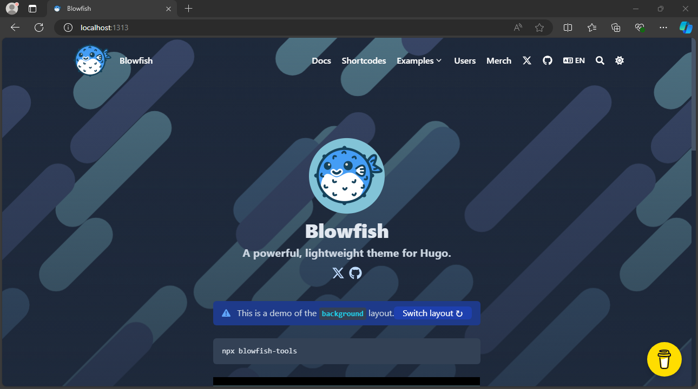
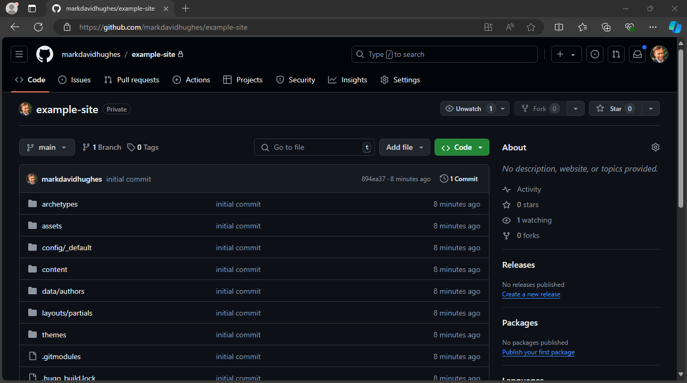
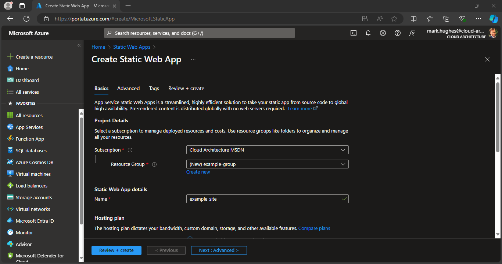
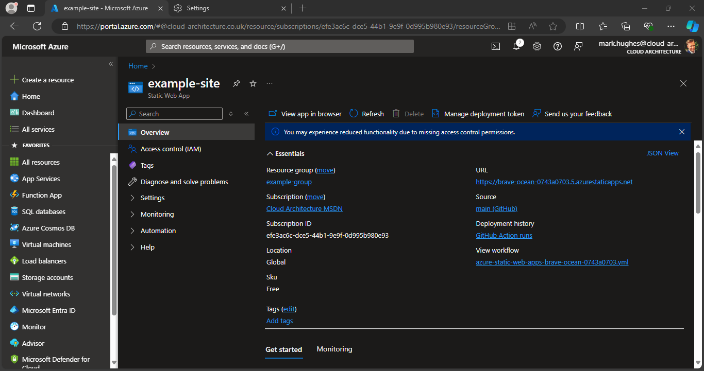
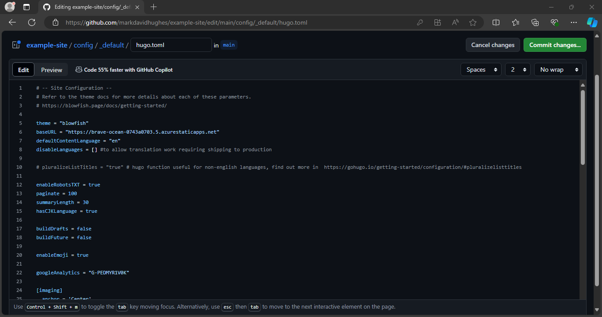
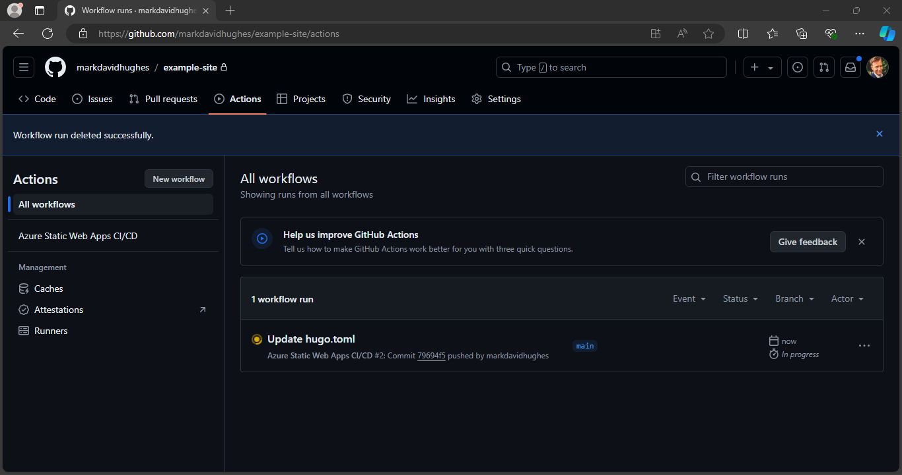
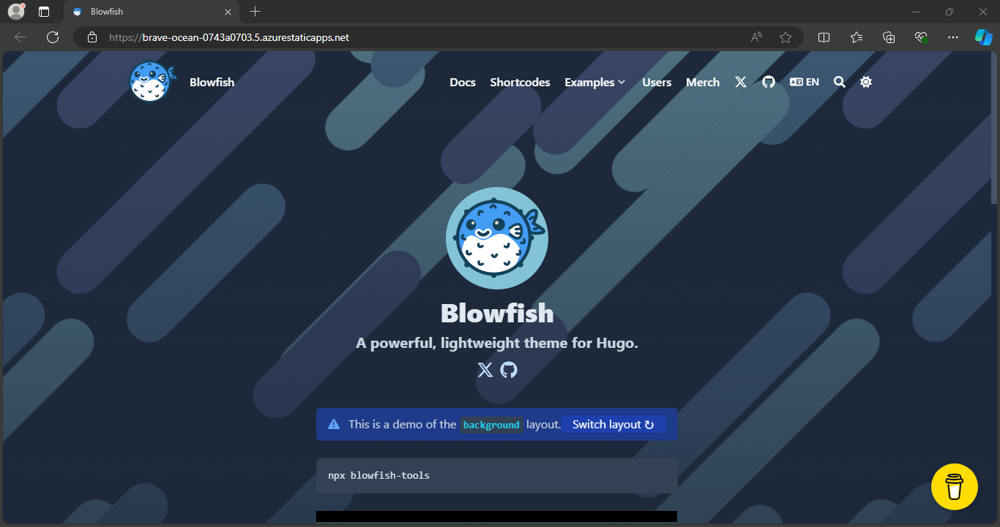


Discover how to create your very own blog just like this one.


This site was built using Hugo and is hosted using a static web application in Microsoft Azure. There are associated GitHub actions which control how the site is built and published.

It uses the Blowfish theme created by Nuno Coração which available from [here](https://github.com/nunocoracao/blowfish "here") and follows the Microsoft Learn guide available from [here.](https://learn.microsoft.com/en-us/azure/static-web-apps/publish-hugo "here")

If you'd like to build something similar you can follow the below steps. My guide is based on using <mark>Windows</mark> and the site name <mark>Example Site</mark>. If you are using a different operating system some commands may differ and you can use your own site name.

## Prerequisites

* An Azure account with an active subscription. If you don't have one, you can [create an account for free.](https://azure.microsoft.com/free/ "create an account for free")
* A GitHub account. If you don't have one, you can also [create an account for free.](https://github.com/join "create an account for free")

## Create a Hugo application
1. In order to create a similar site you must first install Hugo. To install Hugo on Windows simply open up a Command Prompt and run the following and agree to the terms.
```powershell
winget install Hugo.Hugo.Extended
```
2. You also need Git installing. To install this run the following in a command prompt also.
```powershell
winget install --id Git.Git -e --source winget
```
3. Once both of these are installed, restart command prompt and run the Hugo CLI within your chosen directory to create a new site.
```powershell
hugo new site "Example Site"
```
4. Change directory into the newly created site.
```powershell
cd "Example Site"
```
5. Initialize a Git repository for the new site.
```powershell
git init
```
6. Next create a main branch.
```powershell
git branch -M main
```
7. Then add the Blowfish theme to the site by installing the theme as a git submodule.
```powershell
git submodule add https://github.com/nunocoracao/blowfish themes/blowfish
```
8. Now apply the example site to give the new site some content.
```powershell
xcopy themes\blowfish\exampleSite\* .\ /s /y
```
9. Next configure git (replace with your GitHub email) and commit the changes to the main branch
```powershell
git add -A
git config --global user.email "you@example.com"
git commit -m "initial commit"
```
9. Finally preview the example site by running the following and then browsing to `http://localhost:1313/` or the site shown if different.
```powershell
hugo server
```


## Publish to GitHub

A GitHub repository is neeced to connect to Azure Static Web Apps.

1. Create a blank GitHub repo (don't create a README) [here](https://github.com/new "GitHub") named example-site.
2. Add the GitHub repository as a remote to your local repo. Replace <YOUR_USER_NAME> with your GitHub username.
```powershell
git remote add origin https://github.com/<YOUR_USER_NAME>/example-site
```
3. Then push your local repo up to GitHub.
```powershell
git push --set-upstream origin main
```


## Deploy your web app

The following steps show you how to create a new static site app and deploy it to a production environment.

### Create the application

1. Go to the [Azure Portal](https://portal.azure.com/ "Azure Portal").
2. Select Create a Resource.
3. Search for Static Web App.
4. Select Static Web App.
5. Select Create.
6. On the Basics tab, enter the following values.

Property | Value
---------|------
Subscription | Your Azure subscription name.
Resource group | example-group (create a new one)
Name | example-site
Plan type | Free
Source | GitHub

7. Select Sign in with GitHub and authenticate with GitHub.
8. Enter the following GitHub values.

Property | Value
---------|------
Organization | Select your desired GitHub organization.
Repository | Select example-site.
Branch | Select main.

9. In the Build Details section, select Hugo from the Build Presets drop-down and keep the default values.
10. Click next and on the Advanced tab select the region closest to you.



### Review your web app

1. Select Review + Create to verify the details are all correct.
2. Select Create to start the creation of the App Service Static Web App and provision a GitHub Actions for deployment.
3. Once the deployment completes, select Go to resource.



### Update your web app

1. In order for the Blowfish theme to work you will need to update the URL within the themes config file. On the resource screen, copy the URL link to your deployed application. 
2. Within the /config/_default/config.toml file update the baseURL with the copied URL.
3. Commit and push the changes to GitHub which will automatically run the GitHub action to update the site.





### Confirm your deployment

1. Wait a minute or two for the GitHub Actions to complete.
2. Navigate to your web applications URL to confirm deployment



## Conclusion

This will provide you with an Azure static web app similar to mine with the Blowfish theme applied. From here you can add a custom domain and further customise the site.